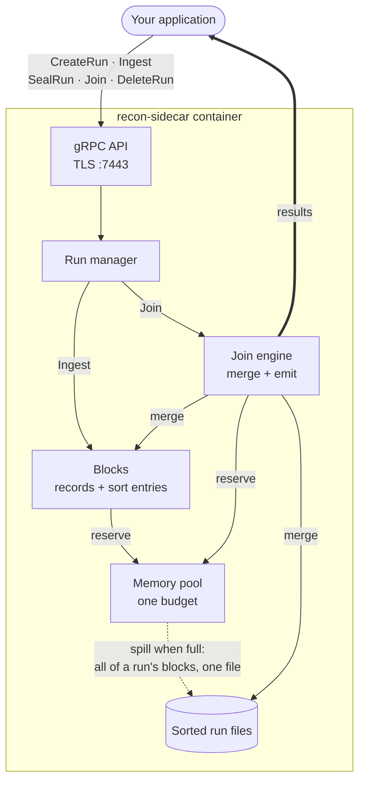
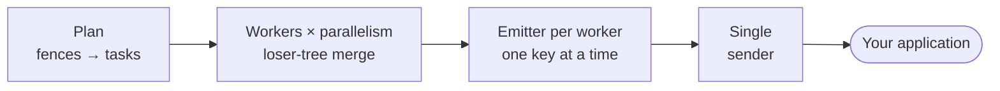
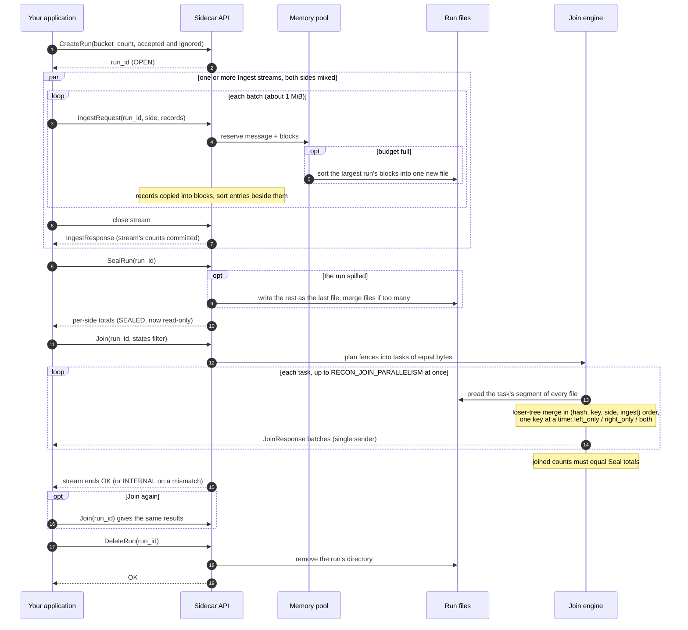
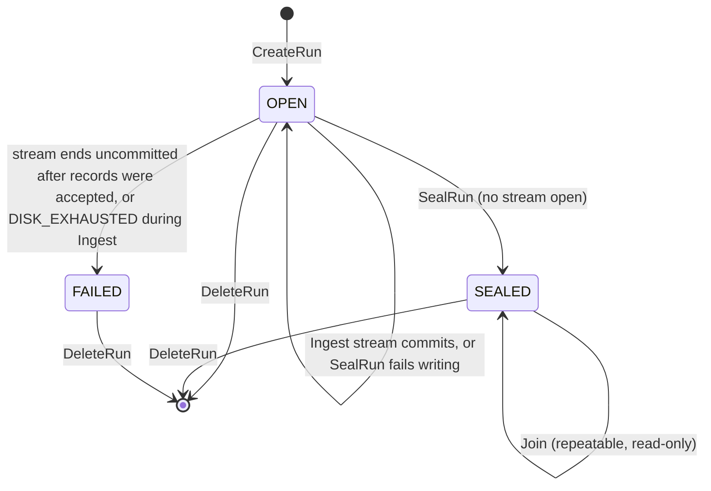
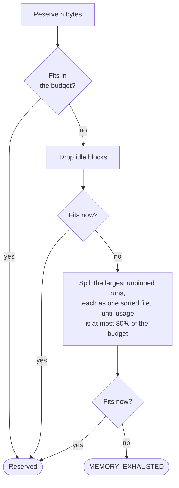

# recon-sidecar POC

This is a proof of concept of the reconciliation sidecar described in [PROPOSAL.md](PROPOSAL.md). It is written in Go on [humus](https://github.com/z5labs/humus), and [PLAN.md](PLAN.md) is the plan it was built from.

The sidecar accepts two sides of records over the `recon.v1` gRPC API (defined in [`proto/recon/v1/reconciler.proto`](proto/recon/v1/reconciler.proto)) and runs a full outer join on them. It returns each key as `left_only`, `right_only` or `both`, and checks the results against control totals. It holds to a fixed memory budget: when the data is larger than the budget it spills sorted runs to disk, and the join merges them as they stream by. A key is limited only by its `Match`: a `Match` larger than `RECON_MAX_MATCH_BYTES` fails with `HOT_KEY`, and a key on one side streams at any size.

The POC set out to answer two questions:

1. **Does the design hold?** Yes. It passes the full end-to-end suite of PLAN.md §8.4, run against the container image. Its output is identical under tiny and huge memory budgets, at every bucket count and parallelism tested.
2. **Can Go keep to a memory budget?** Yes, but only with `GOMEMLIMIT` set. See [Performance](#performance).

The storage and join layer follows the sorted-runs architecture recommended by [BUCKET_ARCHITECTURE_EVALUATION.md](BUCKET_ARCHITECTURE_EVALUATION.md), with its six conditions for adoption built in (see [Sorted runs](#sorted-runs-and-the-conditions-for-adoption)). The hash-bucket design it replaced is described in that report.

## High-level design

The sidecar runs next to your application, in the same pod. Your application streams records for a left and a right side into a **run**, seals it, then streams back the reconciled results. The sidecar never holds more than its memory budget. When the budget is full it sorts what it holds and writes it as one run file, and the join merges a run's files, holding one key at a time.

### Components


```mermaid
flowchart TB
  App(["Your application"])

  subgraph Sidecar["recon-sidecar container"]
    API["gRPC API<br/>TLS :7443"]
    Runs["Run manager"]
    Blocks["Blocks<br/>records + sort entries"]
    Join["Join engine<br/>merge + emit"]
    Pool["Memory pool<br/>one budget"]
    Disk[("Sorted run files")]
  end

  App -- "CreateRun · Ingest<br/>SealRun · Join · DeleteRun" --> API
  API --> Runs
  Runs -- "Ingest" --> Blocks
  Runs -- "Join" --> Join
  Blocks -- "reserve" --> Pool
  Join -- "reserve" --> Pool
  Pool -. "spill when full:<br/>all of a run's blocks, one file" .-> Disk
  Join -- "merge" --> Blocks
  Join -- "merge" --> Disk
  Join == "results" ==> App
```

Inside the join engine:


```mermaid
flowchart LR
  Plan["Plan<br/>fences → tasks"] --> Workers["Workers × parallelism<br/>loser-tree merge"] --> Emitter["Emitter per worker<br/>one key at a time"] --> Sender["Single<br/>sender"] --> Client(["Your application"])
```

| Component | Code | Job |
|---|---|---|
| gRPC API | `internal/api` | Validates every request, checks the run's state, and maps every failure to a gRPC code plus a `ReconError` detail |
| Run manager | `internal/run` | Creates runs with UUIDv7 IDs, enforces `RECON_MAX_RUNS`, tracks each run's state and its per-side record totals, cancels a run's streams and Join on DeleteRun, and owns the one aligned write buffer every spill goes through |
| Records | `internal/record` | The one encoding of a record, in memory and on disk: hash, key and side, value. A key's hash is XXH3, its top byte the record's fence |
| Block memtable | `internal/buffer` | Copies each record once into a 1 MiB block: records from the front, a 16-byte sort entry (hash, offset, ingest ticket) from the back. The goroutine that fills a block sorts its entries. A spill merges every block of the run into one file |
| Merge | `internal/merge` | A loser tree over sorted sources, in (hash, key, side, ingest) order |
| Memory pool | `internal/mem` | Holds the single memory budget. Every block, decoded message, read buffer, arena and output batch reserves before it allocates. Blocks a spill empties stay reserved as idle buffers for the next records, until a reservation needs the room. When a reservation doesn't fit, the goroutine asking for memory drops idle buffers, then spills the largest unpinned runs to 80% of the budget, and retries once. There is no background work |
| Run files | `internal/spill` | Writes sorted run files with direct I/O through an aligned buffer, keeps each file's table of fences, reads segments of them with `pread` through cursors that leave large values on disk until they are emitted, tracks them against `RECON_DISK_LIMIT_BYTES`, and empties the data directory at startup |
| Join engine | `internal/join` | Plans fences into tasks, merges each task's segment of every file and block on a worker, emits results through an arena of chunks and a single sender, checks control totals, and merges files at Seal when there are too many |
| Health | `grpchealth` (humus) | Serves `grpc.health.v1` in plaintext on `:8081` for the startup and readiness probes |

### Lifecycle of a run


```mermaid
sequenceDiagram
  autonumber
  participant App as Your application
  participant API as Sidecar API
  participant Pool as Memory pool
  participant Disk as Run files
  participant Join as Join engine

  App->>API: CreateRun(bucket_count, accepted and ignored)
  API-->>App: run_id (OPEN)

  par one or more Ingest streams, both sides mixed
    loop each batch (about 1 MiB)
      App->>API: IngestRequest(run_id, side, records)
      API->>Pool: reserve message + blocks
      opt budget full
        Pool->>Disk: sort the largest run's blocks into one new file
      end
      Note over API: records copied into blocks, sort entries beside them
    end
    App->>API: close stream
    API-->>App: IngestResponse (stream's counts committed)
  end

  App->>API: SealRun(run_id)
  opt the run spilled
    API->>Disk: write the rest as the last file, merge files if too many
  end
  API-->>App: per-side totals (SEALED, now read-only)

  App->>API: Join(run_id, states filter)
  API->>Join: plan fences into tasks of equal bytes
  loop each task, up to RECON_JOIN_PARALLELISM at once
    Join->>Disk: pread the task's segment of every file
    Note over Join: loser-tree merge in (hash, key, side, ingest) order,<br/>one key at a time: left_only / right_only / both
    Join-->>App: JoinResponse batches (single sender)
  end
  Note over Join: joined counts must equal Seal totals
  API-->>App: stream ends OK (or INTERNAL on a mismatch)

  opt Join again
    App->>API: Join(run_id) gives the same results
  end

  App->>API: DeleteRun(run_id)
  API->>Disk: remove the run's directory
  API-->>App: OK
```

### Run states


```mermaid
stateDiagram-v2
  [*] --> OPEN: CreateRun
  OPEN --> OPEN: Ingest stream commits, or SealRun fails writing
  OPEN --> SEALED: SealRun (no stream open)
  OPEN --> FAILED: stream ends uncommitted after records were accepted, or DISK_EXHAUSTED during Ingest
  SEALED --> SEALED: Join (repeatable, read-only)
  OPEN --> [*]: DeleteRun
  SEALED --> [*]: DeleteRun
  FAILED --> [*]: DeleteRun
```

A Join that fails, for example with `HOT_KEY` or a cancelled client, leaves the run `SEALED`, so it can be retried. A `FAILED` run can only be deleted. SealRun of a run that spilled writes a file, and if that fails, with `DISK_EXHAUSTED` say, the run stays `OPEN` with every record it had: SealRun can be retried once there is room.

### How the join works

- **Ingest.** A record is hashed and copied once into a block of the run. Nothing is partitioned: `bucket_count` is checked against `RECON_MAX_BUCKETS` and then ignored. Each Append section takes an ingest ticket, so a stream's records keep their order.
- **Spill.** When a reservation doesn't fit, the pool spills the largest run: every one of its blocks is merged by its sorted entries into one new file, `runs/<id>/<seq>.run`, in sequential writes of the 1 MiB write buffer. Ingest streams of that run wait while it is written. A run is a few large sorted files, about one per budget of data, whatever its keys.
- **Seal.** A run that spilled writes what it still holds as its last file, so a sealed run holds only its files' fence tables (about 2 KiB each) in memory. If a Join couldn't read all the files with one worker and read buffers of 16 KiB, Seal merges neighbouring files first, unless the pool has no memory for the merge, in which case the Join reads more files. A run that never spilled stays in memory, sorted, and is joined from there.
- **Planning.** The hash's top byte is its fence: 256 equal ranges, which every file records the offsets of. The Join cuts the fences into tasks of about equal bytes, eight per worker, and gives each worker one read buffer per file, as large as the budget allows. It runs fewer workers rather than shrink buffers below 32 KiB, or let their largest Matches take more than three quarters of the budget. The plan depends only on the data, so the batches do too.
- **Merging.** A worker merges its task's segment of every file and block with a loser tree, in (hash, key, side, ingest) order, so each key's left records come before its right ones, each side in ingest order. It holds a key's left records until its first right record, or the next key, shows whether they are a `Match` or `left_only` results. A right record with no left ones before it is `right_only` at once. Nothing is loaded: each byte of a file is read once, sequentially.
- **Hot keys.** A `Match` is held in its worker's arena, a list of chunks that never move, so it needs its size once. A `Match` larger than `RECON_MAX_MATCH_BYTES` fails the Join with `HOT_KEY`, naming the key and its per-side counts. A key on one side only needs no `Match`: once its held records reach the limit, the worker scans the rest of the key without keeping it, finds no right record, emits what it held, goes back, and streams the rest as one-sided results, however many.
- **Large values.** A record larger than its cursor's read buffer is not read whole: the cursor holds its key, and the value is read straight into the arena when its result is emitted. A result larger than `RECON_OUTPUT_BATCH_BYTES` is sent in a batch of its own, so a client whose Matches can exceed 4 MiB must raise its gRPC receive limit (grpc-go's default).
- **Empty keys** hash to 0, sort first and never match one another. Each is a one-sided result.
- **Output and backpressure.** Workers hand finished batches to a single sender, because gRPC allows one send at a time per stream. When your application reads slowly, gRPC flow control blocks the sender, which blocks the workers, so memory stays within budget. A batch's arena and structs are used again once it is sent.
- **Control totals.** The engine counts every record it joined on each side, including results removed by the `states` filter. The stream ends `OK` only if those counts equal the totals returned by SealRun.

### Memory and spilling

The sidecar has one memory pool with one budget (`RECON_MEMORY_LIMIT_BYTES`), shared by every run. Everything that takes real memory reserves from the pool before it allocates, and releases afterwards:

| What reserves | Released | Can the pool reclaim it? |
|---|---|---|
| The spill write buffer: 1 MiB, or a 32nd of a small budget | When the sidecar stops | No |
| An Ingest message, once decoded | As soon as its records are copied into blocks | No, but it lasts one message |
| A run's blocks (its records in memory) | When the run is spilled, or on DeleteRun | **Yes**, by spilling the run, unless a running Join is reading it |
| Idle blocks, emptied by a spill | When a block is taken for new records, of any run | **Yes**, by dropping them |
| A run file's fence table, about 2 KiB | On DeleteRun, or when Seal merges the file | No |
| A Join's read buffers, one per file per worker | When the Join ends | No |
| A Join worker's arena, output batch structs and the key it holds | When the batch is sent, or the Join ends | No |

When a reservation doesn't fit, the goroutine that asked for it frees memory itself. There is no background spiller:


```mermaid
flowchart TB
  R["Reserve n bytes"] --> F{"Fits in<br/>the budget?"}
  F -- yes --> OK(["Reserved"])
  F -- no --> D["Drop idle blocks"] --> F1{"Fits now?"}
  F1 -- yes --> OK
  F1 -- no --> S["Spill the largest unpinned runs,<br/>each as one sorted file, until usage<br/>is at most 80% of the budget"]
  S --> F2{"Fits now?"}
  F2 -- yes --> OK
  F2 -- no --> E(["MEMORY_EXHAUSTED"])
```

**During Ingest,** blocks fill the pool. Once it is full, the next block forces the largest run to spill, all of it, as one file, so a run of 80 times the budget makes about 90 files. The emptied blocks stay reserved as idle buffers and take the next records, so the garbage collector doesn't churn through a budget of blocks per spill.

**At Seal,** a run that spilled writes its last file. A run that didn't keeps its blocks in memory, and stays spillable: if another run needs the room, the sealed run is spilled like any other.

**At Join time,** the workers reserve their memory before the run is pinned, so if a run still in memory doesn't fit next to it, the reservation spills it and the Join reads the file instead. Once pinned, a run's blocks can't be spilled from under the Join. Then the Join holds one key at a time per worker, plus read buffers: 68 MiB reserved during the 10 GiB join of the evaluation, of a 128 MiB budget.

**The pool runs out** only when what it can't reclaim leaves no room: in-flight messages, read buffers, arenas, fence tables and pinned runs. In practice that means several Joins at once under a small budget, a `Match` within the limit whose many tiny values take more than twice the limit to hold, or an Ingest message larger than the budget. The request then fails with `MEMORY_EXHAUSTED` instead of the container being OOM-killed.

#### Sizing: the budget a join runs at full speed in

Join read memory is files × workers × read buffer, and the number of files grows with data over budget. A join runs at full speed while:

```
budget ≥ sqrt(0.3 MiB × workers × data)
```

That is about 110 MiB for 10 GiB with 4 workers. Below it, read buffers shrink first, then the join gives up workers, then Seal merges files. It slows down instead of failing. Measured on the evaluation's prototype: 10 GiB at 128 MiB (92 files, full speed), 10 GiB at 32 MiB (403 files, one worker, 67.5 s join) and 4 GiB at 16 MiB (326 files, one worker, 53.4 s join).

- **Raise three things together:** the container's memory limit, the budget (by default 70% of that limit) and `GOMEMLIMIT` (about 90% of it). Raising the budget without `GOMEMLIMIT` gets the container OOM-killed. Raising the container limit alone does nothing unless the budget follows it, which it does by default.
- **Several runs share the pool.** Eight runs in a 128 MiB pool leave each about 16 MiB, which is the regime where the join slows.
- **Files are few and large,** so network volumes see sequential writes of the 1 MiB buffer and one file per spill, about 92 for 10 GiB at a 128 MiB budget. See [SPILL_STORAGE_RESEARCH.md](SPILL_STORAGE_RESEARCH.md) for the storage classes they suit.
- **Below about 128 KiB** the fence tables of many small spills, and the read buffers of a Join, leave too little of the budget, and runs fail with `MEMORY_EXHAUSTED`.

### Sorted runs and the conditions for adoption

The evaluation made adoption depend on six conditions. Each is built and tested here:

| Condition | How it is met | Tests |
|---|---|---|
| 1. Direct I/O for run writes | Run files are opened with `O_DIRECT` and written in whole aligned buffers; the last write is padded and the file cut back. A filesystem that refuses direct I/O falls back to the page cache | `internal/spill`: `TestWriter_writes_directly_where_it_can`, `TestRunFile_property_round_trips_by_fence` |
| 2. Large values read at emit time | A cursor holds only the header and key of a record larger than its read buffer; the value is read with one `pread` into the arena when its result is emitted, and copied through the cursor when Seal merges files | `internal/join`: `TestRun_large_values_are_read_when_emitted`; `internal/spill`: `TestCursor_*`, `TestCopy_copies_large_values_through_the_cursor`; e2e `TestLargeValues` |
| 3. A chunked arena | A worker's arena is a list of chunks that never move, so a `Match` needs its size once. A group that would outgrow the limit, or twice it in memory, is scanned without being held: `HOT_KEY` if it is a `Match` over the limit, streamed if it is one-sided | `internal/join`: `TestRun_a_Match_needs_its_size_once`, `TestRun_streams_a_one_sided_key_at_any_size`; e2e `TestOneSidedHotKey`, `TestHotKey` |
| 4. A pool-owned free list | Blocks a spill empties go to the pool's idle list, still reserved, and are dropped as soon as any reservation needs the room, so several runs share them exactly | `internal/mem`: `TestPool_idle_buffers_*`, `TestPool_spilling_doesnt_count_idle_buffers`; `internal/buffer`: `TestBuffer_reuses_idle_blocks` |
| 5. Close cancels a Join | DeleteRun cancels the Join's context and doesn't wait for it; the Join frees the run's memory when it ends, and sends nothing more once cancelled | `internal/run`: `TestRun_Delete_during_a_Join_of_files`, `TestDelete_aborts_a_Join`, `TestRun_Delete_during_Seal` |
| 6. A wider conformance suite | The oracle compares value order (`oracle.DiffOrdered`); property tests cover tiny budgets from 128 KiB, hot keys, large values, cancellation, the states filter, spilling at any point, and the live heap during a Join | `internal/join`, `internal/run` property tests; e2e `TestValueOrder` |

## Repository layout

```
PROPOSAL.md        design proposal (§ references point here)
PLAN.md            implementation plan for this POC
proto/             recon.v1 API (shared with the proposal)
poc/               Go module "poc"
  cmd/recon-sidecar/   main
  internal/app/        Init, settings, telemetry
  internal/api/        gRPC server: validation, state checks, error mapping
  internal/run/        run manager and state machine
  internal/mem/        memory reservation pool, idle blocks and spill trigger
  internal/record/     the record encoding, hashes and fences
  internal/buffer/     a run's blocks and sorted run files
  internal/merge/      the loser-tree merge
  internal/spill/      run file writer and cursor, disk accounting, startup wipe
  internal/join/       plan, merge workers, emitter, hot keys, merge at Seal
  internal/oracle/     naive full outer join used by tests
  gen/recon/v1/        generated gRPC code (committed)
  e2e/                 container tests, harness and data generator
  POC-RESULTS.md       full measurement report
```

## Requirements

- Go 1.27
- Podman or Docker. Rootless podman needs the `memory` cgroup controller delegated, otherwise the memory tests mean nothing. `make e2e` checks this before it runs.
- Only to regenerate the gRPC code: `protoc`, `protoc-gen-go` and `protoc-gen-go-grpc`
- Only to regenerate the test generator's reference code (`make reference`): `protoc`, able to find `google/protobuf/timestamp.proto`. A `protoc` built from source needs `PROTOBUF_INCLUDE` set to its `src` directory. The target installs its own pinned `avroc` and `avroc-gen-go` v0.3.0 and `protoc-gen-go` v1.36.6 into `poc/.local/tools`.

All commands below run from `poc/`.

## Running it

### Build and run the container

```sh
cd poc
make run
```

This builds `recon-sidecar:dev` and generates a test CA and server certificate into `poc/.local/tls/`. It then runs the container with a 1 GiB memory limit (change it with `RUN_MEMORY=2g`), publishing these ports on `127.0.0.1`:

| Port | Serves |
|---|---|
| 7443 | `recon.v1.Reconciler`, TLS only |
| 8081 | `grpc.health.v1.Health`, plaintext (the startup and readiness probe) |

The data directory is `poc/.local/data`. The sidecar empties it at startup.

### Call the API by hand

The server has no reflection, so pass [grpcurl](https://github.com/fullstorydev/grpcurl) the proto file:

```sh
grpcurl -cacert .local/tls/ca.pem -import-path ../proto -proto recon/v1/reconciler.proto \
  -d '{"bucket_count":64}' localhost:7443 recon.v1.Reconciler/CreateRun
```

A run goes `CreateRun` → one or more `Ingest` streams → `SealRun` → `Join` (repeatable) → `DeleteRun`.

### Configuration

The sidecar is configured through environment variables. A bad value stops it at startup with exit code 78 and a log record naming the variable. Byte values take a plain integer or an IEC suffix (`128MiB`, `4GiB`).

| Variable | Default | Meaning |
|---|---|---|
| `RECON_TLS_CERT_FILE`, `RECON_TLS_KEY_FILE` | required | PEM server certificate and key |
| `RECON_LISTEN` | `127.0.0.1:7443` (image: `:7443`) | API address |
| `RECON_HEALTH_ADDR` | `:8081` | Health probe address |
| `RECON_DATA_DIR` | `/var/lib/recon` | Spill directory. It must be writable and must not be a tmpfs. |
| `RECON_MEMORY_LIMIT_BYTES` | 70% of the cgroup's `memory.max` | Memory budget. Required when the cgroup has no limit. |
| `RECON_DISK_LIMIT_BYTES` | Free space in the data directory | Spill disk budget |
| `RECON_JOIN_PARALLELISM` | `min(GOMAXPROCS, 4)` | Join merge workers, at most |
| `RECON_MAX_RUNS` | `8` | Runs that can exist at once |
| `RECON_MAX_BUCKETS` | `4096` | Largest `bucket_count`, which is otherwise ignored |
| `RECON_MAX_RECV_MESSAGE_BYTES` | `16MiB` | Largest Ingest message |
| `RECON_OUTPUT_BATCH_BYTES` | `1MiB` | Join output batch size |
| `RECON_MAX_MATCH_BYTES` | `3MiB` | Largest single `Match` before `HOT_KEY`. A one-sided key has no limit |
| `RECON_LOG_KEYS` | `false` | Include keys in logs and `HOT_KEY` errors |
| `RECON_LOG_LEVEL` | `info` | `debug`, `info`, `warn` or `error`. Logs go to stdout as JSON. |
| `RECON_METRICS_EXPORTER` | `none` | `none`, `console` or `otlp` (OpenTelemetry) |

**Always set `GOMEMLIMIT` to about 90% of the container's memory limit** when you run the sidecar at the default budget. Without it the container is OOM-killed under load (see below).

### Tests

| Command | Runs |
|---|---|
| `make test` | Unit, property-based (against the oracle) and in-process gRPC tests, with `-race` |
| `make e2e` | Builds the image, then runs every container test in PLAN.md §8.4; `TestRealisticSpill`, which joins realistic records of varying size under a 4 MiB budget; and the sorted-runs tests of hot keys, large values and value order. About 4 minutes on the machine below. |
| `make e2e-short` | The same, skipping the multi-GiB tests |
| `make proto` | Regenerates `gen/` from `../proto` |
| `make reference` | Re-emits the test generator's reference `.proto` and `.avdl` schemas and regenerates the Go code the byte-exact tests in `e2e/gen/reference` compare values against |

The e2e tests drive the image through the engine's CLI. Set `RECON_E2E_ENGINE` to choose `podman` or `docker`, and `RECON_E2E_IMAGE` to choose the image (the Makefile sets both). Set `RECON_E2E_DATA_ROOT` to choose where the containers' data directories go (`/var/tmp` by default; not a tmpfs). Every container runs with swap disabled (`--memory-swap` equal to `--memory`), so an OOM kill can't be hidden by swapping.

The test data comes from `e2e/gen`, which marshals realistic records as protobuf, Avro or JSON. To see how large and how compressible its profiles are, or to check them against a file of your own values, run `go run ./e2e/gen/cmd/datastats` (`-h` lists the options).

To reproduce the performance numbers, use a data root the filesystem doesn't compress. On btrfs, make an empty directory and run `chattr +m` on it before anything is written there. A pass takes about 12 minutes and needs about 11 GiB of free disk in the data root:

```sh
mkdir /var/tmp/recon-e2e-nocomp && chattr +m /var/tmp/recon-e2e-nocomp
make image
RECON_E2E_IMAGE=recon-sidecar:dev RECON_E2E_DATA_ROOT=/var/tmp/recon-e2e-nocomp go test -tags e2e,measure -run TestMeasure -timeout 3h -v ./e2e/
```

## Performance

> **These numbers were measured on the hash-bucket design this refactor replaced**, before it. They show what the API, the pool and Go's garbage collector cost, which sorted runs don't change. For sorted runs against the bucket design on the same data and limits (10 GiB in 50 s against 73 s at a 128 MiB budget, 92 files against 150,716), see [BUCKET_ARCHITECTURE_EVALUATION.md](BUCKET_ARCHITECTURE_EVALUATION.md#comparison); those were measured on the evaluation's prototype, not on this code. The "Spill files" and "Expansion factor" figures below describe the bucket design only.

Measured on an AMD Ryzen 9 5950X (32 CPUs, 31 GB RAM, NVMe, Fedora 44) under rootless podman. The container had `--memory=512m` with no swap, and `bucket_count` was 1024. The data was marshaled records, the way a client sends them. Unless a row says otherwise, the left side was Payment records and the right side BankLine records, both as protobuf, with 18-byte keys. Their values averaged 226 bytes and compress about 1.8 times with zstd. About 93% of keys had one record on each side. The spill directory was on btrfs with compression turned off. Every result was checked by a streaming verifier. The full method and tables, and the other profiles, are in [poc/POC-RESULTS.md](poc/POC-RESULTS.md).

Earlier versions of these numbers used 1000-byte values that compress 52 times, on a directory that compressed the spill files, and a test client that slowed the join. POC-RESULTS compares them.

### Throughput

| Data | Scenario | Records | Ingest | Join | Ingest + join | Disk peak |
|---|---|---|---|---|---|---|
| Payment/BankLine, protobuf | 1 GiB, 128 MiB budget, `GOMEMLIMIT` unset | 4.4 M | 7.7 s (133 MiB/s) | 2.2 s (472 MiB/s) | 9.9 s | 1,032 MiB |
| Payment/BankLine, protobuf | 1 GiB, 128 MiB budget, `GOMEMLIMIT` 90% | 4.4 M | 6.6 s (155 MiB/s) | 2.7 s (381 MiB/s) | 9.3 s | 1,032 MiB |
| Payment/BankLine, protobuf | 1 GiB, 358 MiB budget (default), `GOMEMLIMIT` 90% | 4.4 M | 4.9 s (210 MiB/s) | 2.5 s (405 MiB/s) | 7.4 s | 965 MiB |
| Payment/BankLine, protobuf | 10 GiB, 128 MiB budget, `GOMEMLIMIT` unset | 43.9 M | 70.7 s (145 MiB/s) | 23.4 s (437 MiB/s) | 94.1 s | 10,633 MiB |
| Payment/BankLine, protobuf | 10 GiB, 128 MiB budget, `GOMEMLIMIT` 90% | 43.9 M | 64.8 s (158 MiB/s) | 22.3 s (458 MiB/s) | 87.1 s | 10,635 MiB |
| Payment/BankLine, protobuf | 10 GiB, 358 MiB budget (default), `GOMEMLIMIT` 90% | 43.9 M | 61.1 s (167 MiB/s) | 23.1 s (444 MiB/s) | 84.1 s | 10,581 MiB |
| Payment/BankLine, Avro | 10 GiB, 358 MiB budget (default), `GOMEMLIMIT` 90% | 53.1 M | 65.9 s (155 MiB/s) | 24.5 s (417 MiB/s) | 90.5 s | 10,664 MiB |
| Payment/BankLine, JSON | 10 GiB, 358 MiB budget (default), `GOMEMLIMIT` 90% | 20.3 M | 49.3 s (208 MiB/s) | 15.9 s (645 MiB/s) | 65.1 s | 10,337 MiB |
| CardSettlement, protobuf | 10 GiB, 358 MiB budget (default), `GOMEMLIMIT` 90% | 66.3 M | 73.1 s (140 MiB/s) | 28.8 s (356 MiB/s) | 101.9 s | 10,833 MiB |
| Envelope, protobuf | 10 GiB, 358 MiB budget (default), `GOMEMLIMIT` 90% | 17.9 M | 46.0 s (223 MiB/s) | 15.3 s (670 MiB/s) | 61.3 s | 10,317 MiB |
| Tiny, protobuf | 275 MiB, 128 MiB budget, `GOMEMLIMIT` unset | 7.0 M | 2.5 s (111 MiB/s) | 2.3 s (120 MiB/s) | 4.8 s | 314 MiB |
| Tiny, protobuf | 275 MiB, 128 MiB budget, `GOMEMLIMIT` 90% | 7.0 M | 2.5 s (109 MiB/s) | 2.2 s (125 MiB/s) | 4.7 s | 310 MiB |
| Old generator, 1000-byte values | 10 GiB, 358 MiB budget (default), `GOMEMLIMIT` 90% | 10.5 M | 36.3 s (281 MiB/s) | 12.1 s (844 MiB/s) | 48.3 s | 10,171 MiB |

Times are wall-clock as the client saw them, and throughput is the key and value bytes sent over that time. Ingest + join is the sidecar's share of a run. SealRun, which runs between the two, wasn't timed, and neither were CreateRun and DeleteRun. The client generated the data and verified every result on the same machine, and the join time includes that verification, so these times are upper bounds for the sidecar.

- **The client can be the limit.** On the old 1000-byte values, a client that verified each result on the goroutine reading the Join stream measured the join at 544 and 554 MiB/s. The client used here verifies on 8 goroutines, and measured 771 and 844 MiB/s with the same data, image and data directory. Whether it limits the joins of realistic records wasn't measured.
- **Smaller records cost more per byte.** The join ran at 1.2 to 2.3 M records/s for the realistic profiles. With Tiny records of 41 bytes of key and value, the cost per record dominates, at about 3 M records/s.
- **The sidecar doesn't compress its spill files,** and the data directory here didn't either, so the disk peak is the space they took: 0.94 to 1.06 times the key and value bytes, and 1.13 to 1.14 times for Tiny records.

In a real pipeline, reading the source can overlap with Ingest, and processing results can overlap with Join, because both stream in batches. Each step then takes about as long as the slower of the two sides.

### Memory

| Scenario | Budget | Pool peak | Peak RSS (VmHWM) | RSS / container limit |
|---|---|---|---|---|
| 1 GiB, 128 MiB budget, `GOMEMLIMIT` unset | 128 MiB | 128.0 MiB | 314 MiB | 61% |
| 10 GiB, 128 MiB budget, `GOMEMLIMIT` unset | 128 MiB | 128.0 MiB | 366 MiB | 71% |
| 1 GiB, default budget, `GOMEMLIMIT` unset | 358 MiB | **OOM-killed 1.6 s into ingest** | | |
| 10 GiB, default budget, `GOMEMLIMIT` unset | 358 MiB | **OOM-killed 1.0 s into ingest** | | |
| 1 GiB, default budget, `GOMEMLIMIT` 90% | 358 MiB | 358.4 MiB | 454 MiB | 89% |
| 10 GiB, default budget, `GOMEMLIMIT` 90% | 358 MiB | 358.4 MiB | 458 MiB | 89% |

- **The reservation accounting holds.** The pool's peak reached the budget in every run and never went over it.
- **Go's garbage collector is the gap.** With `GOMEMLIMIT` unset, the peak resident set was 2.4 to 2.9 times the pool peak. That is the GC's default heap headroom (`GOGC=100`), and it makes the proposal's default budget of 70% of the container limit unworkable.
- **`GOMEMLIMIT` at 90% of the limit closes the gap,** with no measurable loss of throughput. The runtime holds the process at about the soft limit, and about 10% of the container is left for stacks, the binary and gRPC buffers. Every default-budget run with it completed, for every profile and encoding, at 88 to 91% of the container limit. The POC doesn't set `GOMEMLIMIT` itself.
- **Backpressure works.** A client reading at 5 MiB/s pulled 1.1 GiB of results from a 256 MiB container with a 64 MiB budget, over 3 min 40 s. The container was never OOM-killed.

### Expansion factor (bucket design)

In the bucket design, a join unit's working set was 1.03 to 1.17 times its record bytes for the realistic profiles, 1.02 times for the old 1000-byte values, and up to 1.40 times for Tiny records of about 51 encoded bytes. Sorted runs have no join units and no planning factor: a Join holds one key at a time per worker.

## Known limitations

- **Spill compression is not implemented.** The proposal chooses the codec by benchmark in a later milestone. Run files are large sequential blocks, which suit it.
- **The join slows when data far outgrows the budget.** Read buffers shrink, then workers are given up, then Seal merges files. Read-ahead on the cursor that runs dry first is the known remedy, and isn't built.
- **A spill stalls every stream of its run.** A spill is one write of about the budget: about 0.2 s on NVMe, about 1 s at 125 MiB/s. An overlapped or half-budget spill would hide it, and isn't built.
- **Joins of different runs share one pool.** Each sizes its read buffers from what the pool has free, so Joins at once read with smaller buffers, and can still fail with `MEMORY_EXHAUSTED` under a small budget. That is retryable, and the run stays `SEALED`.
- **A `Match` of many tiny values** within `RECON_MAX_MATCH_BYTES` can take more memory than its encoded size: 24 bytes per value besides the value. One that doesn't fit the pool fails with `MEMORY_EXHAUSTED`.
- **A Join blocked by a client that stopped reading** is cancelled by `DeleteRun` at once, and DeleteRun doesn't wait for it, but the Join's goroutine ends only once the client reads again or disconnects.
- **Not measured on this code yet:** the evaluation's benchmarks ran on its prototype. Several runs sharing a pool, a real network volume and skewed keys at benchmark scale remain to be measured.

## Deviations from the proposal

These are listed in [PLAN.md §2](PLAN.md#2-deviations-from-the-proposal). In short: the API uses TCP with TLS instead of a Unix socket, metrics go to OpenTelemetry instead of Prometheus, the test oracle is in Go instead of DuckDB, and spill blocks are uncompressed.
